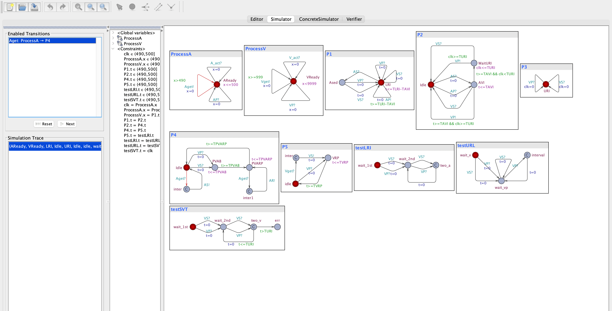
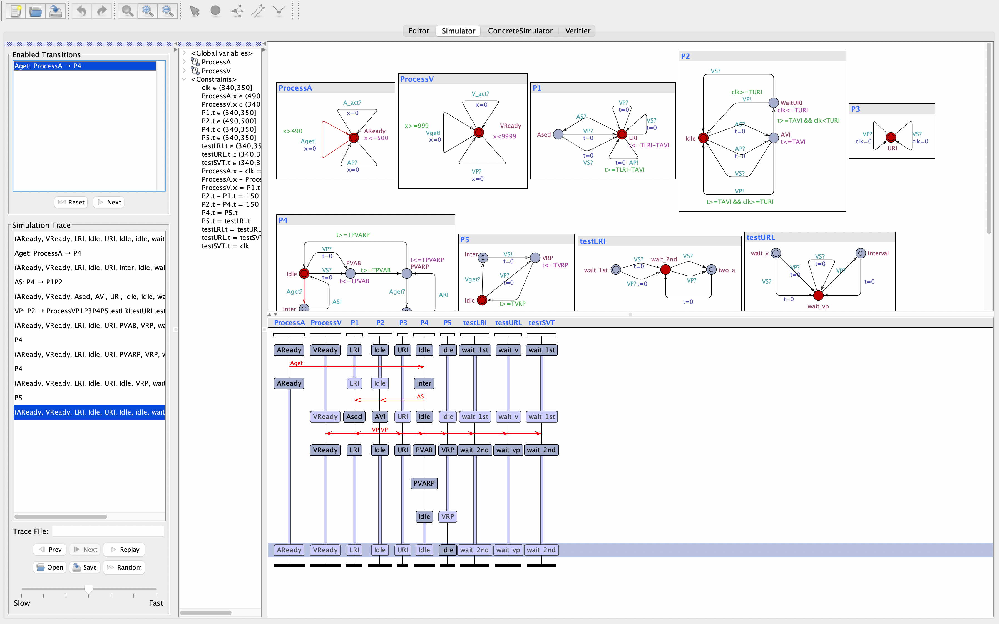

# Formal Method
The UPPAAL model of a DDD pacemaker for model checking.

This model is the implementation of the "Modeling and verification of a dual chamber implantable pacemaker" by Jiang, Zhihao, et al. [Link to the paper](https://link.springer.com/chapter/10.1007/978-3-642-28756-5_14)

The following are images of the simulator from the UPPAAL model checker.

Some images from verifying the model:

